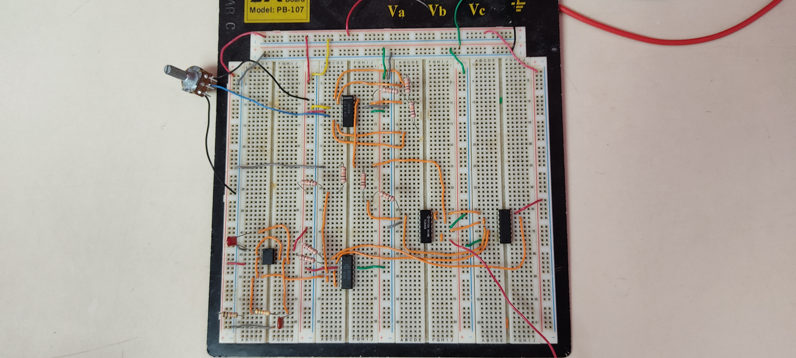
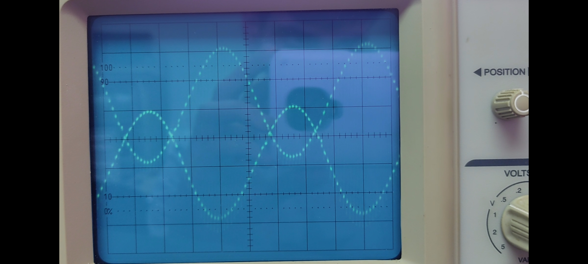
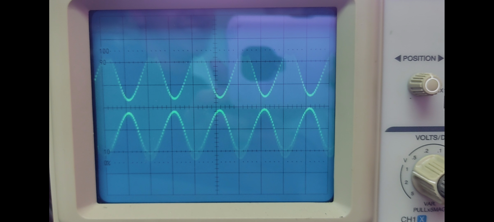

En esta práctica se construyó un modulador AM. Se utilizó una protoboard para montar las distintas etapas del modulador, así como también, el osciloscopio para analizar las distintas etapas y la señal AM. Se realizaron mediciones a la salida del modulador para obtener el índice de modulación y, posteriormente, se calculó la potencia de la portadora, la potencia de las bandas laterales, la potencia total de la señal AM y la fracción del total de potencia que contienen las bandas laterales.

